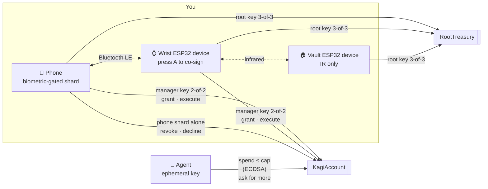

<div align="center">

# 🔑 Kagi Wallet

**A threshold wallet that gives AI agents a spending key, not yours.**

Agents get a capped, expiring key they can spend freely under.
Everything above the cap climbs a ladder of physical devices: your wrist, then a vault you can only reach by light.


</div>

---

> **In one sentence:** Kagi gives an AI agent a capped, expiring on-chain spending key, and anything above the cap needs you to approve on your phone and press a button on a device on your wrist.

## The problem

Agents need money to be useful. Today you either hand them a hot key, and they can drain you, or you approve every transaction, and they're useless. Session keys help, but the root that issues them is still a hot wallet on a server or a phone.

Kagi splits the wallet's authority across devices with **FROST threshold Schnorr (secp256k1)**. No device ever holds a full key, and the smart account enforces the agent's limits on-chain.

## How it works



### The spending ladder

| Action | Who signs | Human in the loop |
|---|---|---|
| Spend under the cap | the agent's ephemeral key | none |
| Grant a key, spend over the cap | phone + wrist ESP32 device (manager key) | face on the phone, press A on the wrist |
| Treasury moves, anything beyond the manager's reach | phone + wrist + vault ESP32 device (root key) | walk to the vault, point the wrist at it |
| Revoke an agent key | the phone's shard alone, or the manager key | one tap, or hold B on the wrist for 2 s |

### Keys

| Key | Type | Held by | Can do |
|---|---|---|---|
| **Manager** | FROST 2-of-2 | phone + wrist ESP32 device | anything on `KagiAccount`: grant, execute, sign ERC-1271 |
| **Root** | FROST 3-of-3 (reshared from 2-of-2) | phone + wrist + vault ESP32 device | anything on `RootTreasury` |
| **Phone** | the phone's shard on its own | phone | revoke only |
| **Session** | ECDSA, made by the agent | the agent, never leaves it | plain ETH transfers under its cap until it expires |

One FROST key has one threshold, and its signature doesn't say who signed. That's why each role gets its own key.

## Repository

```
contracts/   Solidity + Foundry. KagiAccount, RootTreasury, BIP340 verifier, forge tests
firmware/    ESP32-S3 firmware (PlatformIO). One build runs as wrist or vault
  wrist/       the shard firmware: FROST, display, buttons, BLE, WiFi, IR
  irprobe/     bench tool for the IR link
mobile/      Expo / React Native app. The phone shard, the control surface, and its own on-chain client
agent-mcp/   Node. A bare-bones MCP server that gives ChatGPT or Claude an agent wallet
site/        the landing page
IDEA.md      the full design, threat model and demo script
```

## Smart contracts

`contracts/src` has two accounts that share one base. Both verify BIP340 signatures with the ecrecover trick, so threshold Schnorr works on Ethereum with no new precompile.

| Function | Signer | What it does |
|---|---|---|
| `execute(to, value, data, rx, s)` | manager | any call: tokens, approvals, swaps, contracts |
| `grant(agent, cap, expiry, rx, s)` | manager | registers an agent key with a cap and an expiry |
| `revoke(agent, rx, s)` | phone or manager | kills an agent key immediately |
| `raiseLimit(agent, oldCap, newCap, expiry, rx, s)` | manager | raises a key's total allowance, keeping what it spent and its expiry |
| `requestLimit(newCap, reason)` | the agent itself | asks the owner for a higher total; the phone sees the event |
| `declineLimit(agent, newCap, rx, s)` | phone or manager | answers no, so the agent stops waiting |
| `spend(agent, to, value, v, r, s)` | agent | plain ETH only, within the cap, before the expiry, never to the account itself |
| `isValidSignature(hash, sig)` | manager | ERC-1271 |

**Standards supported**

- **ERC-1271:** passes only for the manager key, over `sha256("KAGI/1271" ‖ chainid ‖ account ‖ hash)`. This enables SIWE, Permit2, and CoW, UniswapX or Seaport orders. Agent keys are excluded on purpose: a signed permit moves money without going through `spend`, so it would get around the cap.
- **ERC-721 / ERC-1155 receivers:** `safeTransferFrom` and `safeMint` into the account succeed.
- **ERC-165:** advertises all of the above.
- **Not ERC-4337 (yet):** there is no relayer. The phone pays for its own transactions from a gas wallet, and an agent pays for its own from its session key, which the phone tops up when it grants it.

**Gas** (on-chain `eth_call` estimates)

| Call | Gas |
|---|---|
| deploy `KagiAccount` | ~951k |
| `grant` | ~106k |
| `spend`, first / later | ~90k / ~55k |
| `execute` (ETH transfer) | ~54k |
| `revoke` | ~46k |

## Getting started

### Prerequisites

[Foundry](https://getfoundry.sh) · Node 20+ · [PlatformIO](https://platformio.org) (Python ≥ 3.10) · an Android phone with Expo Go · two ESP32-S3 devices with a screen, buttons and an IR transmitter + receiver

```bash
git clone --recurse-submodules <repo>
# already cloned?
git submodule update --init
```

### 1. Contracts

```bash
cd contracts
forge build
forge test
```

### 2. Agent MCP (optional)

```bash
cd agent-mcp
npm install
npm test                # anvil end to end: spend, ask for more, approve, decline
```

See [`agent-mcp/README.md`](agent-mcp/README.md) to connect ChatGPT or Claude.

To turn on `get_activity`, the history tool backed by Curvegrid MultiBaas, set `MULTIBAAS_URL` and `MULTIBAAS_API_KEY` before `npm start` (see [Curvegrid MultiBaas](#curvegrid-multibaas)).

### 3. Firmware

```bash
cd firmware/wrist
cp src/secrets.example.h src/secrets.h   # optional WiFi settings; the phone link is Bluetooth
pio run -e sticks3 -t upload
pio device monitor
```

Flash the same build to both ESP32 devices, then give the second one the vault role (`set_role`, stored in NVS). See [`firmware/wrist/README.md`](firmware/wrist/README.md) for WiFi quirks and first-flash steps.

### 4. Phone

```bash
adb reverse tcp:8081 tcp:8081
cd mobile
npm install
npx expo run:android
```

The phone talks to the ESP32 devices over **Bluetooth LE** and to the chain directly. It keeps a gas wallet in its secure store: fund its address, shown on Home, with a little test ETH.

## Tests

| Command | What it covers |
|---|---|
| `cd contracts && forge test` | 61 tests: unit and fuzz tests for every path, the official BIP340 vectors, real FROST signatures from the phone code |
| `cd mobile && npx tsx ../contracts/scripts/gen-fixtures.mts` | regenerates the FROST fixture after any change to a signed-message format |
| `cd mobile && npx tsx scripts/frost.test.ts` | both FROST parties in JS, 200 signatures |
| `cd agent-mcp && npm test` | on anvil: the phone's message builders, the contract and the MCP server, through a spend, a limit raise and a decline |

The phone's `src/lib/frost.ts` and the firmware's `src/frost.cpp` must match byte for byte. The fixture test is what catches it when they drift.

## Curvegrid MultiBaas

Kagi is a policy-aware transaction agent: the contract enforces the spending limit, and a person has to approve anything above it. The chain can tell you the current state, like how much allowance is left, but not the story behind it. **MultiBaas gives the agent a memory of what happened.**

The agent MCP's `get_activity` tool reads the wallet's history from the MultiBaas event index: every payment an agent sent, every higher limit it asked for and why, and whether the owner approved it (phone + wrist), declined it or revoked the key. You can ask your AI *"what did my agent spend today, and who approved the raise?"* and get an answer drawn from indexed events, not guesses.

| What | Where |
|---|---|
| MultiBaas client: registers the `KagiAccount` ABI, links each wallet with event indexing, reads its events | [`agent-mcp/multibaas.mjs`](agent-mcp/multibaas.mjs) |
| The `get_activity` MCP tool and how it turns events into sentences | [`agent-mcp/server.mjs`](agent-mcp/server.mjs), `history()` and `get_activity` |

Every user's phone deploys their own wallet, so wallets can't be linked in the MultiBaas console ahead of time. The first time a wallet asks for its history, the server registers the ABI (once per deployment), gives the address an alias and links it with `startingBlock`. After that, calls are just `GET /events?contract_address=…`.

MultiBaas's free plan indexes at most 100 blocks (about 20 minutes) into the past, so the server links a wallet the first time it connects, on any tool and not only `get_activity`. History runs from then on.

**Try it:** create a MultiBaas deployment on the same testnet, make an API key in the Administrators group, then:

```bash
cd agent-mcp
MULTIBAAS_URL=https://<deployment>.multibaas.com MULTIBAAS_API_KEY=<key> npm start
```

Connect your AI with a connector link from the Kagi app, make a couple of payments and one limit request, then ask it for your wallet's activity.

**Our experience with MultiBaas:**
- **Wins:** the deployment was up on the right chain in minutes, and a single `GET /events?contract_address=` call replaced the log scanning we would otherwise do. Free public RPCs refuse `eth_getLogs` without an address, or cap it at 50 blocks. The generated TypeScript SDK's docs were the fastest way to find the exact endpoints and field names.
- **Friction:** `POST /contracts/{label}` documents `bin` as optional, but a contract without bytecode fails with a database error (`null value in column "bytecode"`). We now send an empty string.
- **Surprise:** the free plan indexes at most 100 blocks into the past. We found out from a 403 when linking a wallet (`request exceeds the plan's past logs max depth limit`), so we changed the design to link every wallet the moment it first connects. `GET /plan` lists the limits; it would help to mention them in the linking docs.
- **Wish:** linking contracts by code hash or factory, so every wallet with the same bytecode gets indexed automatically. Kagi deploys one wallet per user, so linking wallets one by one (up to 10 on the free plan) is the part that doesn't scale.

## Team

_TODO: names, roles and social handles._

## Threat model, in short

| If an attacker gets… | They get |
|---|---|
| an agent's ephemeral key | at most the cap, for at most 24 h |
| the phone, or the server and its credentials | one shard: they can't grant or raise limits. They can revoke, which is only a nuisance |
| the wrist ESP32 device | nothing without the phone, and it stops signing after 2 minutes without motion |
| phone **and** wrist | the manager key. Everything behind the root key still needs the vault |
| any remote access at all | still no path to the vault: it has no network after the reshare |

## Status

This is a hackathon build. What isn't done yet:

- **Development firmware:** no secure boot, no flash encryption, reflashable. The production plan (eFuses burned, JTAG and USB download off, no OTA on the vault) is in [IDEA.md](IDEA.md).
- **Agent spends are plain ETH only.** A cap in USDC and a validator that measures balance changes are designed but not built.
- **The wrist has no ERC-1271 signing path yet.** It would need to decode EIP-712 (Permit2 first) so it never signs blind.
- **FROST runs in RAM.** Secure storage protects shards at rest, but each shard is in memory for a few hundred ms per signature.

See **[IDEA.md](IDEA.md)** for the full design, the threat model and the two-act demo.
