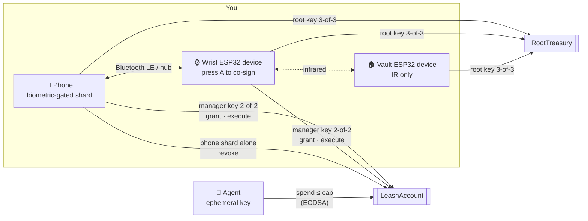

<div align="center">

# 🦮 Leash

**A threshold wallet that gives AI agents a leash, not the keys.**

Agents get a capped, expiring key they can spend freely under.
Everything above the cap climbs a ladder of physical devices: your wrist, then a vault you can only reach by light.


</div>

---

## The problem

Agents need money to be useful. Today you either hand them a hot key, and they can drain you, or you approve every transaction, and they're useless. Session keys help, but the root that issues them is still a hot wallet on a server or a phone.

Leash splits the wallet's authority across devices with **FROST threshold Schnorr (secp256k1)**. No device ever holds a full key, and the smart account enforces the agent's limits on-chain.

## How it works



### The spending ladder

| Action | Who signs | Human in the loop |
|---|---|---|
| Spend under the cap | the agent's ephemeral key | none |
| Grant a key, spend over the cap | phone + wrist ESP32 device (manager key) | face on the phone, press A on the wrist |
| Treasury moves, anything beyond the manager's reach | phone + wrist + vault ESP32 device (root key) | walk to the vault, point the wrist at it |
| Revoke an agent key | the phone's shard alone, or the manager key | one tap, or hold B on the wrist for 2 s |

### Keys

| Key | Type | Held by | Can do |
|---|---|---|---|
| **Manager** | FROST 2-of-2 | phone + wrist ESP32 device | anything on `LeashAccount`: grant, execute, sign ERC-1271 |
| **Root** | FROST 3-of-3 (reshared from 2-of-2) | phone + wrist + vault ESP32 device | anything on `RootTreasury` |
| **Phone** | the phone's shard on its own | phone | revoke only |
| **Session** | ECDSA, made by the agent | the agent, never leaves it | plain ETH transfers under its cap until it expires |

One FROST key has one threshold, and its signature doesn't say who signed. That's why each role gets its own key.

## Repository

```
contracts/   Solidity + Foundry. LeashAccount, RootTreasury, BIP340 verifier, forge tests
firmware/    ESP32-S3 firmware (PlatformIO). One build runs as wrist or vault
  wrist/       the shard firmware: FROST, display, buttons, BLE, WiFi, IR
  irprobe/     bench tool for the IR link
hub/         Node. Relay between phone and ESP32 devices, agent stand-in, Sepolia relayer
mobile/      Expo / React Native app. The phone shard and the control surface
scripts/     online.sh: run everything over public tunnels
IDEA.md      the full design, threat model and demo script
```

## Smart contracts

`contracts/src` has two accounts that share one base. Both verify BIP340 signatures with the ecrecover trick, so threshold Schnorr works on Ethereum with no new precompile.

| Function | Signer | What it does |
|---|---|---|
| `execute(to, value, data, rx, s)` | manager | any call: tokens, approvals, swaps, contracts |
| `grant(agent, cap, expiry, rx, s)` | manager | registers an agent key with a cap and an expiry |
| `revoke(agent, rx, s)` | phone or manager | kills an agent key immediately |
| `spend(agent, to, value, v, r, s)` | agent | plain ETH only, within the cap, before the expiry, never to the account itself |
| `isValidSignature(hash, sig)` | manager | ERC-1271 |

**Standards supported**

- **ERC-1271:** passes only for the manager key, over `sha256("LEASH/1271" ‖ chainid ‖ account ‖ hash)`. This enables SIWE, Permit2, and CoW, UniswapX or Seaport orders. Agent keys are excluded on purpose: a signed permit moves money without going through `spend`, so it would get around the cap.
- **ERC-721 / ERC-1155 receivers:** `safeTransferFrom` and `safeMint` into the account succeed.
- **ERC-165:** advertises all of the above.
- **Not ERC-4337 (yet):** the hub's relayer submits every transaction and pays its gas.

**Gas** (Sepolia `eth_call` estimates from `hub/session-sim.ts`)

| Call | Gas |
|---|---|
| deploy `LeashAccount` | ~951k |
| `grant` | ~106k |
| `spend`, first / later | ~90k / ~55k |
| `execute` (ETH transfer) | ~54k |
| `revoke` | ~46k |

## Getting started

### Prerequisites

[Foundry](https://getfoundry.sh) · Node 20+ · [PlatformIO](https://platformio.org) (Python ≥ 3.10) · an Android phone with Expo Go · two ESP32-S3 devices with a screen, buttons and an IR transmitter + receiver

```bash
git clone --recurse-submodules <repo>
# already cloned?
git submodule update --init
```

### 1. Contracts

```bash
cd contracts
forge build
forge test
```

### 2. Hub

```bash
cd hub
npm install
node compile.mjs        # forge build, then copy the ABI and bytecode for the hub
npm start               # WebSocket :8787 for the phone, TCP :8788 for the ESP32 devices
```

The hub needs a funded Sepolia key in `hub/.relayer` (gitignored) to deploy accounts and relay transactions.

### 3. Firmware

```bash
cd firmware/wrist
cp src/secrets.example.h src/secrets.h   # WiFi SSID, password, hub name and IP
pio run -e sticks3 -t upload
pio device monitor
```

Flash the same build to both ESP32 devices, then give the second one the vault role (`set_role`, stored in NVS). See [`firmware/wrist/README.md`](firmware/wrist/README.md) for WiFi quirks and first-flash steps.

### 4. Phone

```bash
adb reverse tcp:8787 tcp:8787 && adb reverse tcp:8081 tcp:8081
cd mobile
npm install
npx expo start --android --localhost
```

The phone talks to the ESP32 devices over **Bluetooth LE** first, and falls back to the hub (WiFi, relay or USB).

### Anywhere, over the internet

```bash
scripts/online.sh       # hub + Metro through Cloudflare quick tunnels, prints an exp:// link
```

## Tests

| Command | What it covers |
|---|---|
| `cd contracts && forge test` | 53 tests: unit and fuzz tests for every path, the official BIP340 vectors, real FROST signatures from the phone code |
| `cd hub && npx tsx session-sim.ts` | the built contract on real Sepolia through `eth_call` with state overrides; costs nothing |
| `cd hub && npx tsx gen-fixtures.ts` | regenerates the FROST fixture after any change to a signed-message format |
| `cd mobile && npx tsx scripts/frost.test.ts` | both FROST parties in JS, 200 signatures |
| `cd hub && npm run selftest` | end to end on real hardware (wrist on the `sticks3-autotest` build) |
| `cd hub && npx tsx selftest-root.ts` | 3-of-3 reshare and a root signature relayed over IR through the vault |

The phone's `src/lib/frost.ts` and the firmware's `src/frost.cpp` must match byte for byte. The fixture test is what catches it when they drift.

## Threat model, in short

| If an attacker gets… | They get |
|---|---|
| an agent's ephemeral key | at most the cap, for at most 24 h |
| the phone, or the server and its credentials | one shard: they can't grant or raise limits. They can revoke, which is only a nuisance |
| the wrist ESP32 device | nothing without the phone, and it stops signing after 2 minutes without motion |
| phone **and** wrist | the manager key. Everything behind the root key still needs the vault |
| any remote access at all | still no path to the vault: it has no network after the reshare |

## Status

This is a hackathon build. What isn't done yet:

- **Development firmware:** no secure boot, no flash encryption, reflashable. The production plan (eFuses burned, JTAG and USB download off, no OTA on the vault) is in [IDEA.md](IDEA.md).
- **Agent spends are plain ETH only.** A cap in USDC and a validator that measures balance changes are designed but not built.
- **The wrist has no ERC-1271 signing path yet.** It would need to decode EIP-712 (Permit2 first) so it never signs blind.
- **FROST runs in RAM.** Secure storage protects shards at rest, but each shard is in memory for a few hundred ms per signature.

See **[IDEA.md](IDEA.md)** for the full design, the threat model and the two-act demo.
