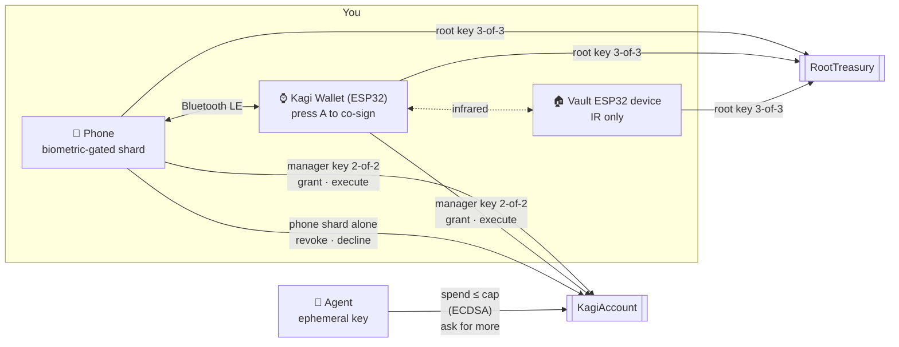

<div align="center">


**A threshold wallet that gives AI agents a spending key, not yours.**

Agents get a capped, expiring key they can spend freely under.
Everything above the cap climbs a ladder of physical devices: your Kagi Wallet, then a vault you can only reach by light.


Integrated with

<a href="https://intercepta.io"><picture><source media="(prefers-color-scheme: dark)" srcset="site/public/partners/intercepta-light.png" /></picture></a> &nbsp;&nbsp;&nbsp; <a href="https://www.curvegrid.com/multibaas"><picture><source media="(prefers-color-scheme: dark)" srcset="site/public/partners/curvegrid-light.png" /></picture></a>

**[Website](https://kagiwallet.com)** · **[Download the Android app](https://github.com/team-somehow/kagi-wallet/releases/download/v0.2.0/kagi-1.0.0.apk)** · **[Flash a stick in the browser](https://kagiwallet.com/#get)** · **[Connect your AI](https://kagiwallet.com/#connect)** · **[Releases](https://github.com/team-somehow/kagi-wallet/releases)**

</div>

---

> **In one sentence:** Kagi gives an AI agent a capped, expiring on-chain spending key, and anything above the cap needs you to approve on your phone and press a button on a device on your Kagi Wallet.

## The problem

Agents need money to be useful. Today you either hand them a hot key, and they can drain you, or you approve every transaction, and they're useless. Session keys help, but the root that issues them is still a hot wallet on a server or a phone.

Kagi splits the wallet's authority across devices with **FROST threshold Schnorr (secp256k1)**. No device ever holds a full key, and the smart account enforces the agent's limits on-chain.

## How it works



### The spending ladder

| Action | Who signs | Human in the loop |
|---|---|---|
| Spend under the cap | the agent's ephemeral key | none |
| Grant a key, spend over the cap | phone + Kagi Wallet (ESP32) (manager key) | face on the phone, press A on the Kagi Wallet |
| Treasury moves, anything beyond the manager's reach | phone + Kagi Wallet + vault ESP32 device (root key) | walk to the vault, point the Kagi Wallet at it |
| Revoke an agent key | the phone's shard alone, or the manager key | one tap, or hold B on the Kagi Wallet for 2 s |

### Keys

| Key | Type | Held by | Can do |
|---|---|---|---|
| **Manager** | FROST 2-of-2 | phone + Kagi Wallet (ESP32) | anything on `KagiAccount`: grant, execute, sign ERC-1271 |
| **Root** | FROST 3-of-3 (reshared from 2-of-2) | phone + Kagi Wallet + vault ESP32 device | anything on `RootTreasury` |
| **Phone** | the phone's shard on its own | phone | revoke only |
| **Session** | ECDSA, made by the agent | the agent, never leaves it | plain ETH transfers under its cap until it expires |

One FROST key has one threshold, and its signature doesn't say who signed. That's why each role gets its own key.

## Repository

```
contracts/   Solidity + Foundry. KagiAccount, RootTreasury, BIP340 verifier, forge tests
firmware/    ESP32-S3 firmware (PlatformIO). One build runs as the Kagi Wallet or the second stick (vault)
  wrist/       the device firmware: FROST, display, buttons, BLE, WiFi, IR
  irprobe/     bench tool for the IR link
mobile/      Expo / React Native app. The phone shard, the control surface, and its own on-chain client
agent-mcp/   Node. A bare-bones MCP server that gives ChatGPT, Claude, Claude Code, Codex, Cursor or VS Code an agent wallet
site/        the landing page, live at https://kagiwallet.com
IDEA.md      the full design, threat model and demo script
```

## Smart contracts

`contracts/src` has two accounts that share one base. Both verify BIP340 signatures with the ecrecover trick, so threshold Schnorr works on Ethereum with no new precompile.

| Function | Signer | What it does |
|---|---|---|
| `execute(to, value, data, rx, s)` | manager | any call: tokens, approvals, swaps, contracts |
| `grant(agent, cap, expiry, rx, s)` | manager | registers an agent key with a cap and an expiry |
| `revoke(agent, rx, s)` | phone or manager | kills an agent key immediately |
| `raiseLimit(agent, oldCap, newCap, expiry, rx, s)` | manager | raises a key's total allowance, keeping what it spent and its expiry |
| `requestLimit(newCap, reason)` | the agent itself | asks the owner for a higher total; the phone sees the event |
| `declineLimit(agent, newCap, rx, s)` | phone or manager | answers no, so the agent stops waiting |
| `spend(agent, to, value, v, r, s)` | agent | plain ETH only, within the cap, before the expiry, never to the account itself |
| `isValidSignature(hash, sig)` | manager | ERC-1271 |

**Standards supported**

- **ERC-1271:** passes only for the manager key, over `sha256("KAGI/1271" ‖ chainid ‖ account ‖ hash)`. This enables SIWE, Permit2, and CoW, UniswapX or Seaport orders. Agent keys are excluded on purpose: a signed permit moves money without going through `spend`, so it would get around the cap.
- **ERC-721 / ERC-1155 receivers:** `safeTransferFrom` and `safeMint` into the account succeed.
- **ERC-165:** advertises all of the above.
- **Not ERC-4337 (yet):** there is no relayer. The phone pays for its own transactions from a gas wallet, and an agent pays for its own from its session key, which the phone tops up when it grants it.

**Gas** (on-chain `eth_call` estimates)

| Call | Gas |
|---|---|
| deploy `KagiAccount` | ~951k |
| `grant` | ~106k |
| `spend`, first / later | ~90k / ~55k |
| `execute` (ETH transfer) | ~54k |
| `revoke` | ~46k |

## On-chain

Every Kagi wallet is its own `KagiAccount` contract. Open one on Etherscan and its **Transactions** tab shows who called what (the owner's phone for `grant` and `raiseLimit`, the agent's key for `spend` and `requestLimit`), **Internal Txns** shows the ETH it paid out, and **Events** shows the audit trail, including Intercepta's reason on a held payment. The contracts are verified on Sourcify, so [Blockscout](https://eth-sepolia.blockscout.com) shows every call and event by name.

**The end-to-end run, step by step** (testnet wallet [`0x397C…4492`](https://sepolia.etherscan.io/address/0x397C50b12730a4f75658DFEd8b8c61A49D174492), [decoded on Blockscout](https://eth-sepolia.blockscout.com/address/0x397C50b12730a4f75658DFEd8b8c61A49D174492)):

| Step | Who signed | Transaction |
|---|---|---|
| 1. The owner gives an agent a key (cap 0.000005 ETH) | phone + Kagi Wallet | [`grant`](https://sepolia.etherscan.io/tx/0x518582dc5475658a526655da95b51c92ead8878321ce2f33f623b90e2eec096c) |
| 2. A clean recipient, paid within the cap | the agent | [`spend`](https://sepolia.etherscan.io/tx/0xe9bfeda3be364c75408d981e0265573d464c76373e7e8e78d334d74bf973b3b7) |
| 3. Intercepta flags the next recipient: held, with the reason on-chain | the agent | [`requestLimit`](https://sepolia.etherscan.io/tx/0x20398a042365a500ec55ee10443751a6c58a417342dc004fce8a4d14cfa10904) |
| 4. The owner approves on the phone and the Kagi Wallet | phone + Kagi Wallet | [`raiseLimit`](https://sepolia.etherscan.io/tx/0xcddf3b82e535c054e759a6ed67cb9521b2a3d0088c5810468fc98e858a65c9b9) |
| 5. The held payment goes out | the agent | [`spend`](https://sepolia.etherscan.io/tx/0x3755a1a00dd86a67c99db04875dffc898ee3e067274879813b18ef834cce4d80) |

The refused payment (Tornado Cash) never reaches the chain: nothing is signed.

**Addresses**

| | Testnet (Sepolia) | Ethereum mainnet |
|---|---|---|
| Demo wallet from the run above | [`0x397C50b12730a4f75658DFEd8b8c61A49D174492`](https://sepolia.etherscan.io/address/0x397C50b12730a4f75658DFEd8b8c61A49D174492) | not deployed yet |
| The current phone's wallet | [`0xB34296ef5846D74d59df70e7f3CEbf0b650478d9`](https://sepolia.etherscan.io/address/0xB34296ef5846D74d59df70e7f3CEbf0b650478d9) | not deployed yet |
| Gas sponsor (deploys testnet wallets, receives demo payments) | [`0xBB0Dd7ca77B6BD6c1AC7F5727139D8D51228DCe0`](https://sepolia.etherscan.io/address/0xBB0Dd7ca77B6BD6c1AC7F5727139D8D51228DCe0) | none: on mainnet the phone uses its own gas wallet |

Each phone deploys its own wallet, so every user's address is different; the app's **Etherscan** button on Home opens yours.

## Getting started

### Prerequisites

[Foundry](https://getfoundry.sh) · Node 20+ · [PlatformIO](https://platformio.org) (Python ≥ 3.10) · an Android phone with USB debugging on (the app uses Bluetooth, so it runs as a development build, not in Expo Go) · two ESP32 S3 boards (screen, buttons, IR transmitter + receiver)

```bash
git clone --recurse-submodules https://github.com/team-somehow/kagi-wallet.git
# already cloned?
git submodule update --init
```

### 1. Contracts

```bash
cd contracts
forge build
forge test
```

### 2. Agent MCP (optional)

```bash
cd agent-mcp
npm install
npm test                # anvil end to end: spend, ask for more, approve, decline
```

See [`agent-mcp/README.md`](agent-mcp/README.md) to connect ChatGPT, Claude, Claude Code, Codex, Cursor or VS Code.

To screen every payment with Intercepta, set `INTERCEPTA_API_KEY` (a free key from [intercepta.io/ethglobal](https://intercepta.io/ethglobal)). To turn on `get_activity`, the history tool backed by Curvegrid MultiBaas, set `MULTIBAAS_URL` and `MULTIBAAS_API_KEY` before `npm start` (see [Curvegrid MultiBaas](#curvegrid-multibaas)).

### 3. Firmware

```bash
cd firmware/wrist
cp src/secrets.example.h src/secrets.h   # optional WiFi settings; the phone link is Bluetooth
pio run -e esp32s3 -t upload
pio device monitor
```

No toolchain? Flash a stick from Chrome or Edge at [kagiwallet.com](https://kagiwallet.com/#get).

Flash the same build to both ESP32 devices, then give the second one the vault role (`set_role`, stored in NVS). See [`firmware/wrist/README.md`](firmware/wrist/README.md) for WiFi quirks and first-flash steps.

### 4. Phone

```bash
adb reverse tcp:8081 tcp:8081
cd mobile
npm install
npx expo run:android
```

Or skip the build and install the APK from the [latest release](https://github.com/team-somehow/kagi-wallet/releases).

The phone talks to the ESP32 devices over **Bluetooth LE** and to the chain directly. It keeps a gas wallet in its secure store: fund its address, shown on Home, with a little test ETH.

## Networks

The app runs on the **testnet (Sepolia)** by default. **More → Ethereum mainnet** switches it to Ethereum mainnet after a confirmation. The same phone and Kagi Wallet stay paired; mainnet gets its own wallet account, so the flow starts again from Home with **Create on-chain account**. Switching back brings the testnet wallet back untouched.

On mainnet:
- The phone uses its own gas wallet, which you fund (about 0.006 ETH to create the account). The testnet gas sponsor compiled into the APK is never used on mainnet.
- The agent MCP server finds each wallet's chain by where its contract lives, so connector links work unchanged.
- Spending history and totals (Curvegrid MultiBaas) are testnet-only for now.
- The contracts are not audited. Keep only small amounts in a mainnet wallet.

## Tests

| Command | What it covers |
|---|---|
| `cd contracts && forge test` | 61 tests: unit and fuzz tests for every path, the official BIP340 vectors, real FROST signatures from the phone code |
| `cd mobile && npx tsx ../contracts/scripts/gen-fixtures.mts` | regenerates the FROST fixture after any change to a signed-message format |
| `cd mobile && npx tsx scripts/frost.test.ts` | both FROST parties in JS, 200 signatures |
| `cd agent-mcp && npm test` | on anvil: the phone's message builders, the contract and the MCP server, through a spend, a limit raise and a decline |

The phone's `src/lib/frost.ts` and the firmware's `src/frost.cpp` must match byte for byte. The fixture test is what catches it when they drift.

## Intercepta: every payment screened before the agent signs

<a href="https://intercepta.io"><picture><source media="(prefers-color-scheme: dark)" srcset="site/public/partners/intercepta-light.png" /></picture></a>

The spending cap limits *how much* an agent can lose. Intercepta decides *who* it may pay. Before the session key signs anything, the agent MCP screens the recipient with the Intercepta API, and the verdict picks the step of Kagi's ladder the payment goes to:

| Verdict | When | What happens |
|---|---|---|
| **Pass** | clean address | the agent pays on its own, within its cap |
| **Hold** | risk score ≥ 30, or exposure traits such as phishing transfers, mixer use or contact with sanctioned addresses | the agent doesn't sign. It files an on-chain request for exactly that payment, with Intercepta's reasons in it. The phone shows **"Intercepta held this payment"** with the reasons, and it only goes out if the owner approves with fingerprint + a hold on the Kagi Wallet. **This applies even when the payment is under the cap** |
| **Refuse** | the recipient itself is sanctioned, a known scammer, blacklisted, or ran a rug pull | refused before signing: no signature, no request to the owner. The AI is told why and not to route around it |

If Intercepta can't be reached, the payment is **held**, never passed. Intercepta's data covers mainnet, so the recipient is screened as a mainnet address while the payment itself runs on a testnet.

**Demo addresses** (live verdicts):

| Recipient | Verdict | Why |
|---|---|---|
| `0xBB0Dd7ca77B6BD6c1AC7F5727139D8D51228DCe0` (the gas sponsor wallet, so demo payments flow back into gas) | pass | risk score 0 |
| `0x7aa25897BB2457F46109EF1886b3F0EBB6E5f67E` | hold | risk score 45: fake phishing transfer |
| `0x098B716B8Aaf21512996dC57EB0615e2383E2f96` (Tornado Cash) | refuse | known scammer, sanctioned address, blacklist |

**Where the API is called:**

| What | Where |
|---|---|
| Quick Scan Address, then Deep Scan (`toxic-score`) on anything flagged, and the pass / hold / refuse policy | [`agent-mcp/intercepta.mjs`](agent-mcp/intercepta.mjs), `screen()` |
| The check inside the payment flow, before the key signs | [`agent-mcp/server.mjs`](agent-mcp/server.mjs), `transfer()` |
| A held payment becomes an on-chain request for the owner | [`agent-mcp/server.mjs`](agent-mcp/server.mjs), the `send_eth` tool |
| The owner sees the verdict before approving on the Kagi Wallet | [`mobile/src/app/limit/[id].tsx`](mobile/src/app/limit/[id].tsx) |

The contract needs no changes: a held payment travels through the existing `requestLimit` → `raiseLimit` path, so it still needs the 2-of-2 threshold signature from phone and Kagi Wallet.

**Feedback on the API:**
- Time to first call: under five minutes. It's one GET with an `X-API-KEY` header, and the response (`toxicScore` + named `traits` with descriptions) is easy to turn into a reason a person can read.
- Confusing: Quick and Deep scans score the same address very differently. Our phishing-dust example is 45 on quick and 100 on deep, so we couldn't use the deep score as a threshold and base refusals on traits instead. The docs don't say what score ranges mean, or which traits mark the address as the *victim* rather than the *culprit* (`fake_phishing_transfer`).
- Rate limits: a quick scan followed immediately by a deep scan got HTTP 429 on the free tier, and the limit isn't documented. We skip the deep scan when the quick one is already decisive, and fall back to the quick result.
- Missing: a single "should I pay this address?" endpoint that returns a recommended verdict (allow / review / deny) alongside the score, and a `chain` parameter to make clear which network the data covers.

## Curvegrid MultiBaas

<a href="https://www.curvegrid.com/multibaas"><picture><source media="(prefers-color-scheme: dark)" srcset="site/public/partners/curvegrid-light.png" /></picture></a>

Kagi is a policy-aware transaction agent: the contract enforces the spending limit, and a person has to approve anything above it. The chain can tell you the current state, like how much allowance is left, but not the story behind it. **MultiBaas gives the agent a memory of what happened.**

The agent MCP's `get_activity` tool reads the wallet's history from the MultiBaas event index: every payment an agent sent, every higher limit it asked for and why, and whether the owner approved it (phone + Kagi Wallet), declined it or revoked the key. You can ask your AI *"what did my agent spend today, and who approved the raise?"* and get an answer drawn from indexed events, not guesses.

On top of the raw history, **MultiBaas Event Queries** aggregate it: `get_spending_summary` (and the app's **Spending** screen, Home → Spending) show what each agent spent and in how many payments, the limit it was granted and raised to, the top recipients, and how many requests were approved, declined, or held or refused by Intercepta, all grouped and added up by MultiBaas. Four **saved queries** (`kagi-spent-by-agent`, `kagi-spent-by-recipient`, `kagi-limit-raises`, `kagi-limit-requests`) give operators a protocol-wide view in the MultiBaas console. The MultiBaas key stays on the agent server; the app asks the server for its own wallet's summary. Details and a diagram: [docs/curvegrid-multibaas.md](docs/curvegrid-multibaas.md).

| What | Where |
|---|---|
| MultiBaas client: registers the `KagiAccount` ABI, links each wallet with event indexing, reads its events, runs the aggregated Event Queries and keeps the saved queries | [`agent-mcp/multibaas.mjs`](agent-mcp/multibaas.mjs) |
| The Spending screen in the app | [`mobile/src/app/spending.tsx`](mobile/src/app/spending.tsx) |
| The `get_activity` MCP tool and how it turns events into sentences | [`agent-mcp/server.mjs`](agent-mcp/server.mjs), `history()` and `get_activity` |

Every user's phone deploys their own wallet, so wallets can't be linked in the MultiBaas console ahead of time. The first time a wallet asks for its history, the server registers the ABI (once per deployment), gives the address an alias and links it with `startingBlock`. After that, calls are just `GET /events?contract_address=…`.

MultiBaas's free plan indexes at most 100 blocks (about 20 minutes) into the past, so the server links a wallet the first time it connects, on any tool and not only `get_activity`. History runs from then on.

**Try it:** create a MultiBaas deployment on the same testnet, make an API key in the Administrators group, then:

```bash
cd agent-mcp
MULTIBAAS_URL=https://<deployment>.multibaas.com MULTIBAAS_API_KEY=<key> npm start
```

Connect your AI with a connector link from the Kagi app, make a couple of payments and one limit request, then ask it for your wallet's activity.

**Our experience with MultiBaas:**
- **Wins:** the deployment was up on the right chain in minutes, and a single `GET /events?contract_address=` call replaced the log scanning we would otherwise do. Free public RPCs refuse `eth_getLogs` without an address, or cap it at 50 blocks. The generated TypeScript SDK's docs were the fastest way to find the exact endpoints and field names.
- **Friction:** `POST /contracts/{label}` documents `bin` as optional, but a contract without bytecode fails with a database error (`null value in column "bytecode"`). We now send an empty string.
- **Surprise:** the free plan indexes at most 100 blocks into the past. We found out from a 403 when linking a wallet (`request exceeds the plan's past logs max depth limit`), so we changed the design to link every wallet the moment it first connects. `GET /plan` lists the limits; it would help to mention them in the linking docs.
- **Wish:** linking contracts by code hash or factory, so every wallet with the same bytecode gets indexed automatically. Kagi deploys one wallet per user, so linking wallets one by one (up to 10 on the free plan) is the part that doesn't scale.

## Team

_TODO: names, roles and social handles._

## Threat model, in short

| If an attacker gets… | They get |
|---|---|
| an agent's ephemeral key | at most the cap, for at most 24 h |
| the phone, or the server and its credentials | one shard: they can't grant or raise limits. They can revoke, which is only a nuisance |
| the Kagi Wallet (ESP32) | nothing without the phone, and it stops signing after 2 minutes without motion |
| phone **and** Kagi Wallet | the manager key. Everything behind the root key still needs the vault |
| any remote access at all | still no path to the vault: it has no network after the reshare |

## Status

This is a hackathon build. What isn't done yet:

- **Development firmware:** no secure boot, no flash encryption, reflashable. The production plan (eFuses burned, JTAG and USB download off, no OTA on the vault) is in [IDEA.md](IDEA.md).
- **Agent spends are plain ETH only.** A cap in USDC and a validator that measures balance changes are designed but not built.
- **The Kagi Wallet has no ERC-1271 signing path yet.** It would need to decode EIP-712 (Permit2 first) so it never signs blind.
- **FROST runs in RAM.** Secure storage protects shards at rest, but each shard is in memory for a few hundred ms per signature.

See **[IDEA.md](IDEA.md)** for the full design, the threat model and the two-act demo.

**Papers:** [The Kagi protocol](docs/kagi-protocol.md) (the contracts, the spending ladder, the standards) and [The cryptography behind Kagi](docs/kagi-cryptography.md) (FROST, BIP340 on Ethereum via `ecrecover`, and how the ERCs fit).
