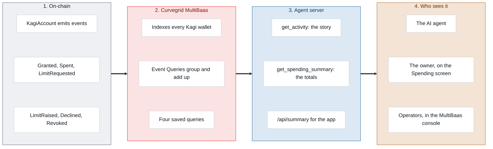

# Kagi and Curvegrid MultiBaas

**MultiBaas is Kagi's memory: what agents spent, who they paid, and who approved it.**

Part of the [Kagi Wallet Protocol](../whitepaper.md).

---

## Why Kagi needs it

The chain tells you the current state: how much allowance an agent has left. It does not tell you the story: which payments went where, which requests were held by Intercepta, which ones the owner approved on their phone and Kagi Wallet. That lives in the account's events, and reading events means scanning logs. Free public RPCs refuse that (we hit "specify an address", "50-block range" and "10,000 blocks max" while building). MultiBaas indexes the events once and answers questions about them in one call.

## How it fits

The MultiBaas API key never leaves the agent server. The phone app asks the server for its own wallet's summary; nothing secret ships in the APK.

## What we use

| MultiBaas feature | How Kagi uses it | Code |
|---|---|---|
| **Contract management** | Registers the `KagiAccount` ABI once per deployment, and links each user's wallet the first time it touches the server (every user's phone deploys their own wallet, so they can't be linked ahead of time). | `agent-mcp/multibaas.mjs`, `ensureLinked` |
| **Event indexing** | Every linked wallet's events are indexed from 100 blocks before its first contact (the free plan's limit). | same |
| **Events API** | `get_activity` reads a wallet's events and turns them into sentences, newest first, with transaction links. | `activity()`, and `history()` in `server.mjs` |
| **Event Queries (arbitrary, aggregated)** | `get_spending_summary` and the app's Spending screen: MultiBaas groups `Spent` by agent and by recipient and adds up the value server side, takes the latest `Granted` cap and the highest `LimitRaised` per agent, and returns the requests with their reasons. | `spendingSummary()` |
| **Saved Event Queries** | Four queries across every Kagi wallet, kept up to date by the server on start, for operators in the MultiBaas console: `kagi-spent-by-agent`, `kagi-spent-by-recipient`, `kagi-limit-raises`, `kagi-limit-requests`. | `DASHBOARD`, `saveDashboard()` |

## What each audience gets

- **The AI agent.** "How much has my agent spent, and who approved the raise?" gets answered from indexed data, not guesses: `get_activity` for the story, `get_spending_summary` for the numbers (spent and payments per agent, limit granted and raised to, top recipients, requests approved, declined, held or refused by Intercepta).
- **The owner.** Home → **Spending** shows the same summary for their wallet: total spent, each agent's spend and limit, top recipients, and approvals with Intercepta's holds and refusals. Pull to refresh.
- **Operators.** The saved queries give a protocol-wide view in the MultiBaas console under Event Queries, with no code.

## How well it's integrated

MultiBaas sits beside the payment path, not on it. Spending, approvals and alerts go straight to the chain, so if MultiBaas is unreachable only history and totals stop. That's deliberate for a wallet, and it means MultiBaas's job is visibility: the audit trail and the numbers that make a policy-aware agent's behaviour legible to its owner.

## Limits we hit

- The free plan indexes at most 100 blocks into the past, so a wallet's history starts shortly before it first uses the server. The server links a wallet on any tool call to make that window as early as possible.
- The free plan links at most 10 contracts, and an event query returns at most 50 rows.
- `POST /contracts/{label}` documents `bin` as optional but fails without it; we send an empty string.
- Event Queries have no `count` aggregator; counts come from the rows themselves.

## Next steps

1. **Webhooks.** MultiBaas calls the agent server on `LimitRaised`, `LimitDeclined` and `Revoked`, so `wait_for_approval` answers the moment the owner decides instead of polling.
2. **Cloud Wallets.** Keep each agent's session key in an Azure Key Vault HSM instead of the connector link.
3. **Transaction Manager.** Resubmit an agent payment that gets stuck (needs Cloud Wallets).
