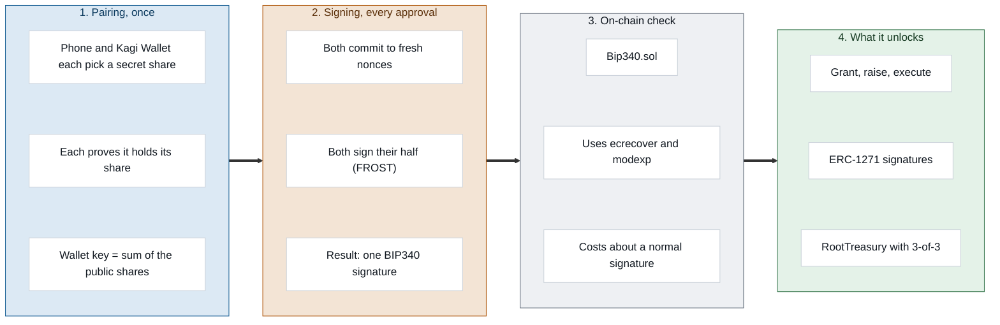

# The cryptography behind Kagi

**How FROST, BIP340, `ecrecover` and the ERCs fit together.**

Part of the [Kagi Wallet Protocol](../whitepaper.md). Code: [`mobile/src/lib/frost.ts`](../mobile/src/lib/frost.ts) and [`root.ts`](../mobile/src/lib/root.ts) (phone), [`firmware/wrist/src/frost.cpp`](../firmware/wrist/src/frost.cpp) (sticks), [`contracts/src/Bip340.sol`](../contracts/src/Bip340.sol) (chain).

---

## 1. The stack at a glance

Every piece is a standard, stacked so that each layer only sees the layer below it:

| Layer | Standard | Its job in Kagi |
|---|---|---|
| Curve | **secp256k1** | Ethereum's and Bitcoin's curve. Everything below uses it. |
| Owner keys | **FROST** (threshold Schnorr, RFC 9591 family) | Split one wallet key across the phone and the sticks. No device ever holds the whole key. |
| Signature format | **BIP340** (Schnorr, from Bitcoin) | What FROST produces: one 64-byte signature `(rx, s)` under one 32-byte x-only public key. |
| Verification on Ethereum | **`ecrecover` + `modexp` precompiles** | Ethereum has no Schnorr precompile. `Bip340.sol` verifies BIP340 with the ECDSA recovery precompile instead. |
| Agent keys | **ECDSA** (Ethereum's native signatures) | The agent's session key signs each `spend`; the contract checks it with plain `ecrecover`. |
| Account interfaces | **ERC-1271, ERC-165, ERC-721/1155 receivers** | Let other contracts ask the wallet to verify signatures, detect its interfaces, and send it NFTs. |
| Transport encryption | **ECIES** (ECDH + AES-256-GCM) | Carries the second stick's share to it, encrypted to its device key. |

### Diagram 2: the cryptography

## 2. FROST: one key, split across devices

### Key generation (distributed, at pairing)

Pairing runs a two-party distributed key generation between the phone and the Kagi Wallet:

1. Each device picks a random secret share `xᵢ` and publishes `Xᵢ = xᵢ·G`.
2. Each publishes a **proof of possession** with it: a Schnorr signature `(R, s)` proving it knows `xᵢ`, under the challenge `H("KAGI/pop" ‖ R ‖ Xᵢ)`. Without it, a malicious device could pick `X₂ = Y − X₁` and end up owning the group key alone (a rogue-key attack). Each side rejects a public share whose proof fails.
3. The group key is `P = X₁ + X₂`. BIP340 keys have even y, so if `P` has odd y both devices negate their shares, which negates `P` without changing its x.
4. Only `P.x` (32 bytes) goes on-chain as `groupKey`. The secret key `x₁ + x₂` is never computed anywhere.

Both screens show a pairing code, `sha256("KAGI/pair" ‖ phoneNonce ‖ wristNonce)`, so the owner can see the phone is talking to the right stick.

### Signing (two rounds, every approval)

Kagi runs FROST with all parties signing (n-of-n), so shares are plain additive and no Lagrange coefficients are needed:

1. **Commit.** Each device draws two fresh nonces `dᵢ, eᵢ` and sends `Dᵢ = dᵢ·G`, `Eᵢ = eᵢ·G`.
2. **Bind.** Each computes `ρᵢ = H("KAGI/rho" ‖ i ‖ m ‖ D₁ ‖ E₁ ‖ D₂ ‖ E₂)`. Binding every nonce to the message and to everyone's commitments is what makes FROST safe with concurrent signing sessions: no one can reuse or shift a nonce after seeing the others.
3. **Aggregate the nonce.** `Rᵢ = Dᵢ + ρᵢ·Eᵢ`, `R = ΣRᵢ`. If `R` has odd y, every party negates its effective nonce.
4. **Respond.** With the BIP340 challenge `c = H_tag("BIP0340/challenge", R.x ‖ P.x ‖ m)`, each device returns `zᵢ = dᵢ + ρᵢ·eᵢ + c·xᵢ`.
5. **Combine.** The phone checks each partial against that device's public share (`zᵢ·G = Rᵢ + c·Xᵢ`), so a bad share is pinned on its owner. It then outputs `(R.x, s = Σzᵢ)` and verifies it with a stock BIP340 verifier before sending it anywhere.

The result is an ordinary BIP340 signature. Nothing on-chain reveals that two or three devices made it, or which.

The Kagi Wallet never signs a hash it was handed. For every action it rebuilds the preimage `m` from the fields on its screen (amount, recipient, cap, expiry, nonce) and signs only that.

### The second stick: resharing 2-of-2 into 3-of-3

Adding the second stick keeps the same group key, so the same wallet address:

1. The phone picks a random `r₁` and the Kagi Wallet picks `r₂`. Each encrypts its piece to the second stick's device key with **ECIES** (ECDH on secp256k1, key `sha256("KAGI/ecies" ‖ shared x)`, AES-256-GCM).
2. The new shares are `x₁' = x₁ − r₁`, `x₂' = x₂ − r₂`, `x₃ = r₁ + r₂`, so `x₁' + x₂' + x₃ = x₁ + x₂` and `P` does not move.
3. The phone checks `X₁' + X₂' + X₃ = P` before anyone commits. The phone never sees `r₂`, so the phone and Kagi Wallet together still cannot rebuild the second stick's share.

This happens in a two-minute radio window with a fingerprint compared on both screens. From then on the second stick signs only over infrared, with the same FROST rounds for three parties (`ρᵢ = H("KAGI/rhoN" ‖ i ‖ m ‖ D₁ ‖ E₁ ‖ … ‖ D₃ ‖ E₃)`).

### Why one key per role

A FROST key has exactly one threshold, and its signatures don't say who signed. So each role gets its own key rather than one key with rules:

- **Manager, 2-of-2 (phone + Kagi Wallet):** the `groupKey` of `KagiAccount`.
- **Phone key, the phone's share alone:** `phoneKey`, allowed only to revoke and decline. Stopping should need one device; starting should need two.
- **Root, 3-of-3 (phone + Kagi Wallet + second stick):** owns `RootTreasury`.

## 3. BIP340 on Ethereum with `ecrecover`

Ethereum has a precompile for ECDSA public-key recovery (`ecrecover`) but none for Schnorr. `Bip340.sol` uses the recovery maths to do the Schnorr check.

A BIP340 signature `(rx, s)` on message `m` under key `P` is valid if `s·G − e·P = R`, where `R` is the point with x-coordinate `rx` and even y, and `e = H_tag(rx ‖ P.x ‖ m)`.

`ecrecover(z, v, r, s')` returns the address of `r⁻¹·(s'·Q − z·G)`, where `Q` is the point with x-coordinate `r` and parity `v`. Kagi calls it with:

- `r = P.x` and `v = 27`, so `Q = P` (the group key has even y),
- `z = −s·P.x` and `s' = −e·P.x`.

Then `r⁻¹·(s'·Q − z·G) = P.x⁻¹·(−e·P.x·P + s·P.x·G) = s·G − e·P`, exactly the point that must equal `R`. `ecrecover` returns its **address** rather than the point, so the contract lifts `rx` to its even-y point (a square root mod p through the `modexp` precompile at address 5), hashes it into an address, and compares.

One `ecrecover` (3,000 gas) and one `modexp` call: threshold signatures cost about the same as ordinary ones, with no new precompile and no bridge to Bitcoin tooling.

## 4. The agent's key: plain ECDSA

The session key is an ordinary Ethereum key held by the agent MCP server. For each payment it signs `keccak256("KAGI/spend" ‖ chainid ‖ account ‖ agent ‖ sessionNonce ‖ to ‖ value)`, and `spend` checks it with plain `ecrecover`. The key never leaves the server; the phone never sees its private key after creating it. Its power is bounded by the contract, not by trust: a cap, an expiry, no calldata, no self-calls.

## 5. The ERCs: how the wallet talks to other contracts

| ERC | What other contracts ask | Kagi's answer |
|---|---|---|
| **ERC-1271** `isValidSignature(hash, sig)` | "Did this wallet sign this hash?" (Sign-In with Ethereum, Permit2, CoW, UniswapX and Seaport orders) | Yes only if `sig` is a **manager** BIP340 signature over `sha256("KAGI/1271" ‖ chainid ‖ account ‖ hash)`. The wrapper binds the chain and the account, so a signature can't be replayed on another account that shares the group key. Session keys are never accepted: a permit moves money without passing through `spend`. |
| **ERC-165** `supportsInterface(id)` | "Which interfaces do you implement?" | ERC-165 itself, ERC-721 receiver, ERC-1155 receiver, ERC-1271. |
| **ERC-721 / ERC-1155 receivers** | `onERC721Received`, `onERC1155Received`, `onERC1155BatchReceived` | Accept, so NFTs can be sent with `safeTransferFrom`. Only the manager's `execute` moves them out. |

Not used, deliberately: **ERC-4337** (no bundler or EntryPoint; anyone can submit a signed call and pay its gas) and **EIP-712** (fixed preimages the Kagi Wallet can rebuild and show instead of generic typed data).

## 6. Keeping the two implementations honest

The phone (TypeScript, `@noble/curves`) and the sticks (C++, mbedTLS) implement the same FROST independently. They must agree byte for byte, so the repo carries a fixture of real FROST signatures made by the phone code, which the Solidity tests verify on-chain alongside the official BIP340 test vectors (61 Foundry tests), and a JavaScript test that runs both FROST parties for 200 signatures.

## 7. Limits worth saying out loud

- **Shares at rest vs in use.** Secure storage on Android and the sticks protects shares at rest. The FROST maths runs in RAM, so a share is in memory for a few hundred milliseconds per signature.
- **Development firmware.** No secure boot, no flash encryption. Production would burn eFuses, turn JTAG off and ship the second Kagi Wallet without OTA.
- **ERC-1271 has no nonce.** As with any EOA signature, replay protection for signed orders and permits is the verifying app's job.
