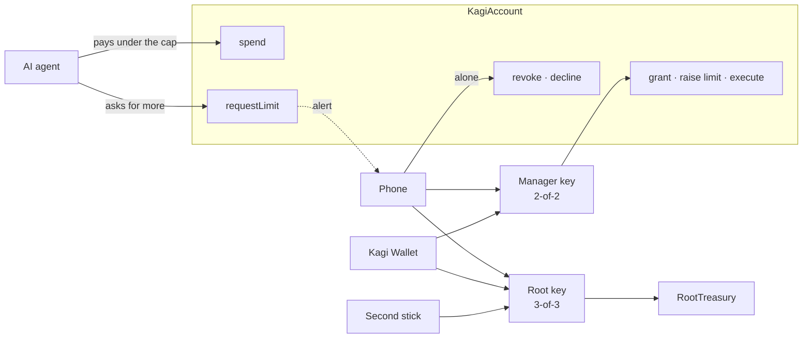

# The Kagi protocol

**A smart account that gives AI agents a spending key, not the wallet.**

Kagi Wallet, ETHGlobal Tokyo 2026. Contracts: [`contracts/src`](../contracts/src). The cryptography is in the companion paper, [The cryptography behind Kagi](kagi-cryptography.md).

---

## 1. The problem

An agent that pays for things needs a key. Today there are two bad choices:

- **Give it a hot key.** It can spend everything, and so can anyone who takes the server it runs on.
- **Approve every transaction.** The owner becomes the bottleneck and the agent stops being useful.

Session keys are a step forward, but the key that issues them is usually still one hot key on a server or a phone. Whoever holds that key holds the wallet.

## 2. The idea

Kagi separates **spending** from **authority**:

1. An agent gets a **session key** with a **cap** and an **expiry**. Under the cap it pays on its own, with nobody in the loop.
2. Everything above the cap climbs a **ladder of physical devices**: the owner's phone and their Kagi Wallet, an ESP32 stick, then optionally a second stick reachable only by infrared.
3. The wallet key that climbs the ladder is **never whole**. It is split across the devices with FROST threshold signatures. The chain sees one ordinary public key and one ordinary signature, and cannot tell which devices signed.
4. **The smart account enforces all of it.** A compromised server can spend at most what is left of one key's cap, and a compromised phone alone can only stop things, never start them.

## 3. The contracts

Four contracts, 277 lines of Solidity.

| Contract | Role |
|---|---|
| **`KagiBase`** | The shared base: one x-only group public key, a nonce, and `execute`, which runs any call the group key signed. |
| **`KagiAccount`** | The agent-facing wallet. Extends `KagiBase` with session keys, caps, expiries, limit requests, revocation and ERC-1271. |
| **`RootTreasury`** | A minimal account owned by the 3-of-3 root key (phone, Kagi Wallet and the second stick). Same call format as `execute`, so the same signing code works. |
| **`Bip340`** | A library that verifies BIP340 Schnorr signatures on-chain using `ecrecover`, so threshold Schnorr works on Ethereum with no new precompile. |

### Diagram 1: the protocol

The arrows are the only ways in. The agent can reach two functions, and one of them only emits an event. Every other function needs a signature from keys the owner's devices hold.

## 4. The spending ladder

| Action | Who signs | Human in the loop |
|---|---|---|
| Pay under the cap | the agent's session key | none |
| Grant a key, raise a limit, any other call | phone + Kagi Wallet (manager key) | fingerprint on the phone, hold on the Kagi Wallet |
| Move treasury funds | phone + Kagi Wallet + second stick (root key) | as above, plus the second stick over infrared |
| Stop a key, decline a request | the phone's share alone | one tap |

Stopping is deliberately cheaper than starting: any single device the owner has can revoke, but no single device can grant, raise or move.

## 5. Functions

**Manager (phone + Kagi Wallet, one BIP340 signature from the 2-of-2 key):**

- `grant(agent, cap, expiry, rx, s)`: registers a session key with a lifetime allowance and an expiry. Replaces any earlier session for that key.
- `raiseLimit(agent, oldCap, newCap, expiry, rx, s)`: raises the allowance and keeps what was spent. The signed message includes the old cap and the expiry, so a stale approval cannot revive a revoked key or apply after the session changed.
- `execute(to, value, data, rx, s)`: any call at all: tokens, approvals, swaps, contracts.
- `isValidSignature(hash, sig)`: ERC-1271, so the wallet can sign in, sign permits and sign orders (see §7).

**The phone's share alone (or the manager):**

- `revoke(agent, rx, s)`: sets the session's expiry to zero, effective immediately.
- `declineLimit(agent, newCap, rx, s)`: records a refusal so the agent stops waiting.

**The agent:**

- `spend(agent, to, value, v, r, s)`: the only way an agent moves money. Checks that the signature is from that session key, the session is live, `spent + value ≤ cap`, and the recipient is not the account itself. **No calldata**: a session cannot approve a token, call a contract or reenter the account, which closes the usual ways around a spending cap.
- `requestLimit(newCap, reason)`: a live session asks for a higher total with a reason of up to 200 bytes. It changes nothing; it emits `LimitRequested`, which the owner's phone watches.

**Events:** `Granted`, `LimitRequested`, `LimitRaised`, `LimitDeclined`, `Spent`, `Revoked`, `Executed`. They are the protocol's audit trail. The agent MCP server reads them back through Curvegrid MultiBaas to answer "what did my agent spend, and who approved it?".

## 6. Replay protection

Every signed message commits to a **domain tag**, the **chain id**, the **account address** and a **nonce**:

| Message | Preimage (hashed with sha256, signed with BIP340) |
|---|---|
| execute | `"KAGI/evm" ‖ chainid ‖ account ‖ nonce ‖ to ‖ value ‖ data` |
| grant | `"KAGI/grant" ‖ chainid ‖ account ‖ nonce ‖ agent ‖ cap ‖ expiry` |
| raise | `"KAGI/limit" ‖ chainid ‖ account ‖ nonce ‖ agent ‖ oldCap ‖ newCap ‖ expiry` |
| revoke | `"KAGI/revoke" ‖ chainid ‖ account ‖ nonce ‖ agent` |
| decline | `"KAGI/decline" ‖ chainid ‖ account ‖ nonce ‖ agent ‖ newCap` |
| ERC-1271 | `"KAGI/1271" ‖ chainid ‖ account ‖ hash` |
| spend (ECDSA, keccak256) | `"KAGI/spend" ‖ chainid ‖ account ‖ agent ‖ sessionNonce ‖ to ‖ value` |

The tag stops a signature for one action being used as another; the chain id and account stop it being replayed on another chain or another account that shares the same group key; the nonce (the account's for the owner, each session's own for the agent) stops it being replayed at all. The Kagi Wallet rebuilds each preimage itself from the fields it shows on its screen before it signs, so it never signs an opaque hash.

## 7. Standards

| Standard | Used for |
|---|---|
| **ERC-1271** | The wallet answers `isValidSignature` for the **manager key only**, over the wrapped `KAGI/1271` message. That enables Sign-In with Ethereum, Permit2 and CoW, UniswapX or Seaport orders. Session keys are excluded on purpose: a signed permit or order moves money without passing through `spend`, so it would get around the cap. |
| **ERC-721 / ERC-1155 receivers** | `safeTransferFrom` and `safeMint` into the account succeed. Only the manager's `execute` can move tokens out. |
| **ERC-165** | Advertises itself, both receivers and ERC-1271. |
| **BIP340 + FROST** | The owner's keys. See [the cryptography paper](kagi-cryptography.md). |

What the protocol deliberately does **not** use: **ERC-4337** (there is no bundler or EntryPoint; anyone may submit a signed call and pay its gas, in practice the phone's gas wallet and the agent's own session address) and **EIP-712** (messages use the fixed preimages above, which the Kagi Wallet can rebuild and display).

## 8. Screening before signing

The contract caps how much an agent can lose. It cannot know who is on the other side of a payment. The agent MCP server screens every recipient with **Intercepta** before the session key signs:

- **Pass** (clean): the agent pays on its own, within its cap.
- **Hold** (exposure, such as phishing transfers or contact with sanctioned addresses): the key does not sign. The server files a `requestLimit` for exactly that payment with Intercepta's reasons in the `reason` field, so only phone + Kagi Wallet can release it, even under the cap.
- **Refuse** (the recipient itself is sanctioned, a known scammer or blacklisted): nothing is signed. The owner is still alerted and can bypass it with every device that holds the wallet key.

If Intercepta cannot be reached, the payment is held, never passed. Screening lives off-chain, in the agent; the contract's cap is what bounds the worst case if the agent itself is compromised.

## 9. Security model

| If an attacker gets… | They get |
|---|---|
| an agent's session key | at most what is left of its cap, until it expires or the phone revokes it |
| the phone, or the agent server and its credentials | one share: they cannot grant, raise or execute. They can revoke, which is a nuisance |
| the Kagi Wallet | nothing without the phone |
| phone **and** Kagi Wallet | the manager key. Funds in `RootTreasury` still need the second stick |
| any remote access at all | no path to the second stick, which signs only over infrared |

Known limits of this build: caps count ETH only (a token cap and a balance-delta validator are designed, not built); the firmware is development firmware (no secure boot or flash encryption); FROST shares sit in RAM for a few hundred milliseconds per signature.

## 10. Cost

On-chain `eth_call` estimates:

| Call | Gas |
|---|---|
| deploy `KagiAccount` | ~951k |
| `grant` | ~106k |
| `spend`, first / later | ~90k / ~55k |
| `execute` (ETH transfer) | ~54k |
| `revoke` | ~46k |

A BIP340 check through `ecrecover` plus one `modexp` call costs a few thousand gas, so a threshold-signed action costs about the same as an ordinary one.

## 11. Summary

Kagi turns "trust the agent" into a number the chain enforces. The agent spends freely under that number; raising it takes the owner's hand on a physical device; and the key that can raise it never exists in one place.
