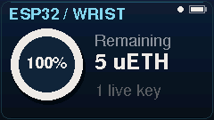
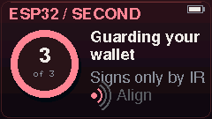

# ESP32 spatial UX

The phone, interactive website and physical displays share a blue wrist / red second-device theme. The device illustrations have a screen and a round control on the right, labeled ESP32. The hardware target remains StickS3: use its actual A/B buttons. The production firmware does not approve automatically.

## Try it on the phone

Open **Kagi → More → In-app test agent**. No external chat client is required. This is a real Sepolia test agent running on the phone, explicitly distinct from the website simulation.

1. Create a 60-minute session with a total allowance of **0.000005 ETH** (5 µETH). Unlock the phone and approve on the required devices.
2. Run **act one**. The agent sends 2 µETH to ABC, then pauses its 8 µETH transfer and requests 20 µETH total. Unlock the phone, verify the amount, and hold A on the device(s). Only a confirmed limit increase resumes the waiting transfer.
3. Add the second ESP32 to the same wallet, if it has not already joined. This strengthens future grants and increases; it does not change the account or interrupt under-limit agent payments.
4. Run **act two** with that same session. It requests 44 µETH total before sending 12 µETH. Both devices must approve; request and signature travel by IR.

ABC is `0xD130448ff0c82Cd4f8044E41ACE6cA5289A88107`, the existing MCP contact. The screen shows this destination before starting. Act one needs at least 10 µETH in the wallet, act two needs another 12 µETH. The session key separately needs test ETH for fees. The app funds this at grant, and reports if that top-up fails.

The connected wallet was already three-party. Disconnecting the red ESP32 does **not** turn it into a two-party wallet. A fresh one-device-to-two-device presentation requires a separately prepared wallet; do not erase the connected wallet merely to rehearse act one.

## Actual behavior

- Native perspective device drawings, gradients, role colors and round controls. Arrows follow signing and IR events, rather than pretending that a transaction has confirmed.
- Foreground keep-awake is enabled by default. It releases when Kagi leaves the foreground; normal system timeout settings are unchanged.
- Hardware uses shaded panels and rings, miniature ESP32s during IR, moving approval arrows, readable microETH amounts, and gentler attention/success tones. Speaker power still turns off during IR reception.
- Presentation settings control wrist sound. Legacy fake-wallet controls and destructive reset are removed from this menu.
- Session key copy is primary. Product screens and connector choices no longer reference Claude or Claude Code; no external client configuration was changed.
- BLE sends complete frames in sequence. Failed writes reject outstanding waits. Biometric failures cannot silently unlock the phone share.
- Second-device joining persists the phone's new share before committing the wrist, validates the operation ID and public share, and can resume an interrupted commit. The firmware's durable commit journal finishes interrupted writes on reboot.
- Limit/grant submissions retain transaction hashes and distinguish pending confirmation from failure. Contract calls track saved pending hashes on retry. Revocation reports confirmed results instead of assuming immediate success.
- The in-app agent saves its plan, progress and pending transaction hashes; **Resume saved run** reconciles them. It never has manager authority and still needs physical signatures for a limit increase.

## Firmware and builds

Firmware **0.3.1**, production `sticks3` environment. Both devices run the same binary; their saved role selects blue or red. Normal upload preserves wallet NVS. Do not use `sticks3-autotest`, erase-flash, or change roles on a joined wallet.

The website includes the matching factory firmware and SHA-256 in `site/src/data.ts`. The checked-in manifest points to it. The existing APK link is the earlier public release; this branch's Android build is installed on the connected phone and can also be built from `mobile/`.

Read-only USB diagnostics: `hello?` includes `fw` and `uiTheme`. `ui_snapshot` returns a JSON size header followed by packed RGB888 pixels, only outside signing/IR work. Captures from the actual devices:

## Validation

- 61 contract tests passed, including allowance enforcement, replay rejection, unchanged spend/expiry on raises and BIP340 fuzz coverage.
- Mobile typecheck and lint; Android release build and installation preserving app data.
- 200 two-party signatures; ten reshares preserving the group key; forty three-party signatures including thirty approvals; invalid and mixed-old-share rejection.
- MCP end-to-end tests on isolated Anvil passed, including queued transfer after approval, decline, contacts and session isolation.
- Website production build and browser walkthrough: early hold release, decline, first approval, join, both IR approvals, final balances (10 / 22 µETH), no horizontal overflow at 390 px and no console errors.
- Both physical devices flashed successfully, with blue/red display captures and existing three-party configuration preserved.
- Connected phone confirmed foreground wake lock across multiple minutes. A real three-device grant completed over IR, leaving a live 5 µETH session.
- The in-app agent confirmed its real 2 µETH Sepolia transfer and submitted the 5 → 20 µETH increase request. The live rehearsal paused at the phone's fingerprint prompt; physical approval and the queued 8 µETH transfer have not yet been verified.

A fresh live two-to-three-party reshare was not repeated on this already-joined wallet. The physical test does not simulate device button holds or bypass phone authentication.
