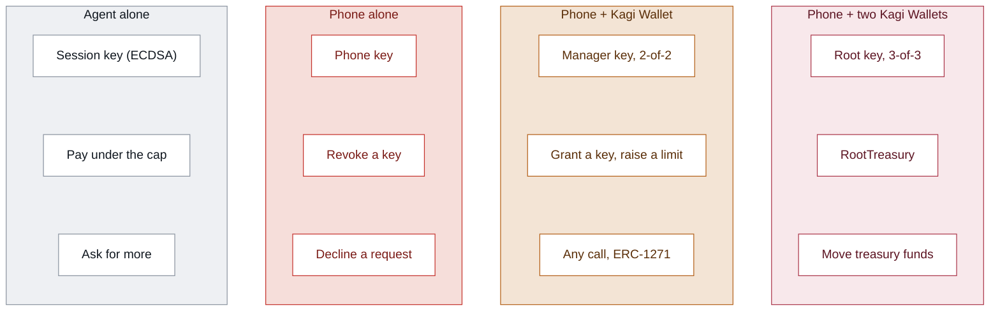
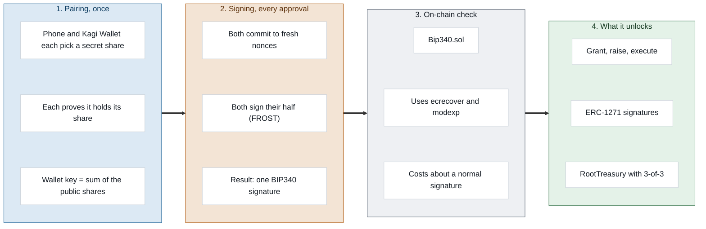

# Kagi Wallet Protocol

**A wallet system that gives AI agents a spending key, not the wallet.**

Version 0.3 · September 2026 · ETHGlobal Tokyo 2026
Live on Ethereum mainnet and Sepolia · Source: [github.com/team-somehow/kagi-wallet](https://github.com/team-somehow/kagi-wallet)

---

## Abstract

AI agents need money to be useful, and today every way of giving it to them is bad: a hot key the agent (or whoever breaches its server) can drain, or a human who approves every transaction. The Kagi Wallet Protocol separates *spending* from *authority*. An agent gets a session key with a cap and an expiry, enforced by a smart account on-chain, and spends freely under it. Everything above the cap climbs a ladder of physical devices the owner holds: their phone and a Kagi Wallet (an ESP32 device), then optionally a second Kagi Wallet reachable only by infrared. The key that climbs the ladder is never whole: it is split across those devices with FROST threshold Schnorr signatures, and the chain verifies the result as one ordinary BIP340 signature through Ethereum's `ecrecover` precompile. Before an agent signs any payment, the recipient is screened by Intercepta; afterwards, every payment and approval is indexed and totalled by Curvegrid MultiBaas. The result: a compromised agent server can lose at most one key's remaining cap, a compromised phone can only stop things, and nothing above the cap moves without the owner's hands.

## 1. The problem

| Today's option | What goes wrong |
|---|---|
| Give the agent a hot key | It can spend everything, and so can anyone who takes the server it runs on |
| Approve every transaction | The owner becomes the bottleneck; the agent stops being useful |
| Session keys from a hot root key | Better, but whoever holds the root key holds the wallet, and it still lives on a server or a phone |
| Custody networks with policy code | The policy is enforced off-chain by someone else's nodes; the owner trusts the network |

What an agent's owner actually wants is a number: *this agent may spend up to X, until Y, and anything more asks me.* The protocol makes that number something the chain enforces, and makes "asks me" something only the owner's own hardware can answer.

## 2. Design

Four principles:

1. **Spending and authority are different keys.** The agent's key can only spend under a cap. Granting keys, raising caps and moving anything else needs the owner's key.
2. **The owner's key is never whole.** It is split across devices the owner holds with FROST. No device, server or network ever has the full key.
3. **The chain enforces the rules.** Caps, expiries and who may do what live in the smart account, not in an app or a server that could be bypassed.
4. **Stopping is cheaper than starting.** Any single device can revoke an agent. No single device can grant, raise or move.

## 3. System overview

| Component | What it is |
|---|---|
| **Kagi app** (Android) | The owner's phone: holds one key share behind the fingerprint, deploys the wallet, shows requests, and signs its half of every approval. Wallet, Spending and More tabs. |
| **Kagi Wallet** (ESP32) | An M5StickS3 (ESP32-S3) running open firmware: holds the second key share, shows exactly what it is about to sign, and signs only when its button is held. Talks to the phone over Bluetooth LE. |
| **Second Kagi Wallet** (optional) | The same device in the vault role: holds a third share of the root key and communicates only by infrared, so it has no network path at all. |
| **KagiAccount** | The smart account on Ethereum: enforces caps, expiries and roles, verifies the owner's threshold signatures and the agent's ECDSA signatures. |
| **Agent MCP server** | Gives any MCP client (Claude, ChatGPT, Codex, Cursor) a wallet: holds the session key for the length of each request, screens recipients with Intercepta, signs spends, files limit requests, and reads history from MultiBaas. |
| **Intercepta** | Screens every payment recipient before the agent's key signs. |
| **Curvegrid MultiBaas** | Indexes every wallet's events and totals them for the agent and the owner. |

### Who can do what

| Key | Type | Held by | Can do |
|---|---|---|---|
| **Session** | ECDSA | the agent (the MCP server), made per key | `spend` plain ETH under its cap until it expires; `requestLimit` |
| **Phone** | the phone's share alone, BIP340 | the phone | `revoke`, `declineLimit` |
| **Manager** | FROST 2-of-2, BIP340 | phone + Kagi Wallet | everything on `KagiAccount`: `grant`, `raiseLimit`, `execute`, ERC-1271 |
| **Root** | FROST 3-of-3, BIP340 | phone + Kagi Wallet + second Kagi Wallet | everything on `RootTreasury` |

A FROST key has one threshold and its signature does not reveal who signed, so each role gets its own key rather than one key with rules.

## 4. The smart contracts

Four contracts, 277 lines of Solidity 0.8.30, 61 Foundry tests.

| Contract | Role |
|---|---|
| `KagiBase` | One x-only group key, a nonce, and `execute`, which runs any call the group key signed. |
| `KagiAccount` | The agent-facing wallet: sessions, caps, expiries, limit requests, revocation, ERC-1271. |
| `RootTreasury` | A minimal account owned by the 3-of-3 root key, same call format as `execute`. |
| `Bip340` | BIP340 Schnorr verification using `ecrecover` and the `modexp` precompile. |

### Functions

| Function | Signer | Effect |
|---|---|---|
| `grant(agent, cap, expiry, rx, s)` | manager | registers a session key with a lifetime allowance and an expiry |
| `raiseLimit(agent, oldCap, newCap, expiry, rx, s)` | manager | raises the allowance, keeping what was spent; binds the old cap and expiry so a stale approval cannot revive a revoked key |
| `execute(to, value, data, rx, s)` | manager | any call: tokens, approvals, swaps, contracts |
| `revoke(agent, rx, s)` | phone or manager | ends the session immediately |
| `declineLimit(agent, newCap, rx, s)` | phone or manager | records a refusal so the agent stops waiting |
| `requestLimit(newCap, reason)` | the session key | asks for a higher total with a reason of up to 200 bytes; changes nothing, emits `LimitRequested` |
| `spend(agent, to, value, v, r, s)` | the session key | sends plain ETH: signature from that key, session live, `spent + value ≤ cap`, recipient not the account itself, **no calldata** |
| `isValidSignature(hash, sig)` | manager | ERC-1271 |

`spend` carries no calldata, so a session key cannot approve a token, call a contract or reenter the account: the usual ways around a spending cap are closed.

### Replay protection

Every signed message commits to a domain tag, the chain id, the account address and a nonce:

| Message | Preimage |
|---|---|
| execute | `sha256("KAGI/evm" ‖ chainid ‖ account ‖ nonce ‖ to ‖ value ‖ data)` |
| grant | `sha256("KAGI/grant" ‖ chainid ‖ account ‖ nonce ‖ agent ‖ cap ‖ expiry)` |
| raise | `sha256("KAGI/limit" ‖ chainid ‖ account ‖ nonce ‖ agent ‖ oldCap ‖ newCap ‖ expiry)` |
| revoke | `sha256("KAGI/revoke" ‖ chainid ‖ account ‖ nonce ‖ agent)` |
| decline | `sha256("KAGI/decline" ‖ chainid ‖ account ‖ nonce ‖ agent ‖ newCap)` |
| ERC-1271 | `sha256("KAGI/1271" ‖ chainid ‖ account ‖ hash)` |
| spend | `keccak256("KAGI/spend" ‖ chainid ‖ account ‖ agent ‖ sessionNonce ‖ to ‖ value)` |

The Kagi Wallet rebuilds each preimage itself from the fields on its screen before signing, so it never signs an opaque hash.

### Standards

| Standard | Use |
|---|---|
| **ERC-1271** | Manager key only, over the wrapped `KAGI/1271` message: Sign-In with Ethereum, Permit2, CoW, UniswapX and Seaport orders. Session keys are excluded on purpose, because a signed permit moves money without passing through `spend`. |
| **ERC-721 / ERC-1155 receivers** | `safeTransferFrom` into the wallet succeeds; only `execute` moves tokens out. |
| **ERC-165** | Advertises itself, both receivers and ERC-1271. |
| **BIP340 + FROST** | The owner's keys (§6). |

Not used, deliberately: **ERC-4337** (anyone may submit a signed call and pay its gas: the phone's gas wallet for the owner's actions, the session key's own address for the agent's) and **EIP-712** (fixed preimages the Kagi Wallet can rebuild and display).

## 5. The approval ladder

| Action | Who signs | Human in the loop |
|---|---|---|
| Pay under the cap | the session key | none |
| Grant a key, raise a limit, anything else | phone + Kagi Wallet | fingerprint on the phone, hold the Kagi Wallet's button |
| Move treasury funds | phone + both Kagi Wallets | as above, plus the second Kagi Wallet over infrared |
| Stop a key, decline a request | the phone alone | one tap, or hold the Kagi Wallet's button for 3 seconds on its home screen |

When an agent needs more, it files `requestLimit`. The phone watches for the event and buzzes the Kagi Wallet, even from the background. The owner sees the amount and the reason on the phone, unlocks their share with a fingerprint, and holds the Kagi Wallet's button; a tap says no. The Kagi Wallet has a single button (G10): **hold to approve, tap to refuse**.

## 6. Cryptography

**Key generation.** At pairing, the phone and the Kagi Wallet each pick a random share `xᵢ` and publish `Xᵢ = xᵢ·G` with a Schnorr proof of possession (challenge `H("KAGI/pop" ‖ R ‖ Xᵢ)`), which prevents a rogue-key attack. The group key is `P = X₁ + X₂`, negated if needed so it has even y, as BIP340 requires. Only `P.x` goes on-chain; the secret `x₁ + x₂` is never computed anywhere. Both screens show a pairing code derived from both devices' nonces.

**Signing.** FROST with all parties signing (n-of-n, additive shares). Each device commits two fresh nonces `Dᵢ, Eᵢ`; a binding factor `ρᵢ = H("KAGI/rho" ‖ i ‖ m ‖ all commitments)` ties every nonce to the message and to the others; with the BIP340 challenge `c = H_tag(R.x ‖ P.x ‖ m)`, each device returns `zᵢ = dᵢ + ρᵢ·eᵢ + c·xᵢ`. The phone checks each partial against its device's public share, combines them into `(R.x, Σzᵢ)`, and verifies the result with a stock BIP340 verifier before sending it. The signature is indistinguishable from a single-key one.

**Adding the second Kagi Wallet.** An additive reshare that keeps the group key, so the wallet address does not change: the phone and the Kagi Wallet each encrypt a random piece to the second device's key (ECIES: ECDH on secp256k1, AES-256-GCM), the new shares sum to the old key, and the phone checks `X₁' + X₂' + X₃ = P` before anyone commits. The phone never sees the other piece, so the phone and first Kagi Wallet together cannot rebuild the second device's share. It happens in a two-minute radio window with fingerprints compared on both screens; afterwards the second device signs only over infrared.

**Verification on Ethereum.** There is no Schnorr precompile. `Bip340.sol` calls `ecrecover(−s·P.x, 27, P.x, −e·P.x)`, which returns the address of `s·G − e·P`, exactly the point that must equal `R`; it lifts `R.x` to its even-y point with one `modexp` call and compares addresses. One `ecrecover` and one `modexp`: a threshold signature costs about the same as an ordinary one.

The phone (TypeScript, `@noble/curves`) and the firmware (C++, mbedTLS) implement FROST independently; a fixture of real signatures from the phone code is checked on-chain in the Foundry tests alongside the official BIP340 vectors.

## 7. Agents

The agent MCP server gives any MCP client a Kagi wallet through a connector link that carries the wallet address and the session key. The key exists only for the length of each request, and the server finds the wallet's chain by where its contract lives, so the same link works on the testnet and on mainnet.

| Tool | What it does |
|---|---|
| `get_wallet` | allowance left, total, expiry, balance, network |
| `send_eth` | screens the recipient, then pays, holds or refuses (§8); over the allowance, files a limit request |
| `wait_for_approval` | waits for the owner; once approved on-chain, sends the waiting payment |
| `request_higher_limit` | asks for a higher total with a reason |
| `get_activity` | the wallet's history as sentences, from MultiBaas |
| `get_spending_summary` | totals per agent and recipient, approvals and Intercepta holds, from MultiBaas |

## 8. Screening: Intercepta

The cap limits *how much* an agent can lose. Intercepta decides *who* it may pay. Before the session key signs, the server screens the recipient (a quick scan, then a deep scan on anything flagged), and the verdict picks the step of the ladder:

| Verdict | When | What happens |
|---|---|---|
| **Pass** | clean | paid within the cap |
| **Hold** | risk score ≥ 30, or exposure such as phishing transfers, mixer contact or sanctioned counterparties | not signed; a `requestLimit` for exactly that payment carries Intercepta's reason on-chain, and the owner must approve on the phone and the Kagi Wallet, **even under the cap** |
| **Refuse** | the recipient itself is sanctioned, a known scammer or blacklisted | not signed; the owner is still alerted and may bypass it only with every device that holds the wallet key |

If Intercepta cannot be reached, the payment is held, never passed. The Kagi Wallet buzzes and shows Intercepta's mark for six seconds; the phone shows the reason with Decline or Bypass.

## 9. Record: Curvegrid MultiBaas

The chain can say how much allowance is left, not why. MultiBaas indexes every wallet's events (`Granted`, `Spent`, `LimitRequested`, `LimitRaised`, `LimitDeclined`, `Revoked`) from the first time the wallet uses the server, and its Event Queries group and total them server side:

- **The agent** answers "what did my agent spend, and who approved it?" from records (`get_activity`, `get_spending_summary`).
- **The owner** sees the same totals in the app's Spending tab.
- **Operators** see four saved queries across every Kagi wallet in the MultiBaas console.

The MultiBaas key stays on the agent server; the app asks the server for its own wallet's summary. MultiBaas sits beside the payment path, not on it: if it is unreachable, only history stops.

## 10. Networks and deployments

The protocol runs on **Sepolia** (default) and **Ethereum mainnet**, switched in the app under More after a confirmation. The same phone and Kagi Wallet key shares own one wallet per network. On mainnet the phone uses its own gas wallet, funded by the owner, never a shared sponsor.

| | Sepolia | Ethereum mainnet |
|---|---|---|
| **Owner's wallet** (same key shares) | [`0xcC07e8B413ab4b2fe63f8a9CC7576EaCD2414b7b`](https://sepolia.etherscan.io/address/0xcC07e8B413ab4b2fe63f8a9CC7576EaCD2414b7b) | [`0xc20bE65912f5E45d6B5Fc7c32C0a55e122Ee16D5`](https://etherscan.io/address/0xc20bE65912f5E45d6B5Fc7c32C0a55e122Ee16D5) |
| Deploy transaction | | [`0xb271bc94…b499`](https://etherscan.io/tx/0xb271bc94e41e1a5d2ef55a10d249a43c39adf884577113590a63af905e95b499) |
| Gas wallet | [`0xBB0D…DCe0`](https://sepolia.etherscan.io/address/0xBB0Dd7ca77B6BD6c1AC7F5727139D8D51228DCe0) (shared testnet sponsor) | [`0xA0Ae…e7c1`](https://etherscan.io/address/0xA0Ae08CEA829283Ea1c4f9AdA4092936626Ee7c1) (the phone's own) |
| Full end-to-end run | [`0x397C…4492`](https://sepolia.etherscan.io/address/0x397C50b12730a4f75658DFEd8b8c61A49D174492): grant, clean spend, Intercepta hold, approval, released spend | |

Every wallet above is verified on Sourcify, so Blockscout decodes each call and event. The README's On-chain section links the end-to-end run transaction by transaction.

### Cost

| Call | Gas |
|---|---|
| deploy `KagiAccount` | 1,161,232 (measured on mainnet) |
| `grant` | ~106k |
| `spend`, first / later | ~90k / ~55k |
| `execute` (ETH transfer) | ~54k |
| `revoke` | ~46k |

At the 0.06 gwei base fee when the mainnet wallet was deployed, creating it cost about 0.00018 ETH.

## 11. Security model

| If an attacker gets… | They get |
|---|---|
| an agent's session key | at most what is left of its cap, until it expires or the phone revokes it |
| the agent server and its credentials | the session keys it holds for the length of a request, each bounded by its cap |
| the phone | one share: they cannot grant, raise or execute. They can revoke, which is a nuisance |
| the Kagi Wallet | nothing without the phone |
| the phone **and** the Kagi Wallet | the manager key. Funds in `RootTreasury` still need the second Kagi Wallet |
| any remote access | no path to the second Kagi Wallet, which signs only over infrared |

Screening happens in the agent server, so a compromised server could skip it; the contract's cap is what bounds the worst case.

## 12. Limits

- **Unaudited.** The contracts and firmware have not been audited. Keep only small amounts in a mainnet wallet.
- **Development firmware.** No secure boot or flash encryption; the production plan (eFuses burned, JTAG off, no OTA on the second Kagi Wallet) is in [IDEA.md](IDEA.md).
- **Shares in memory.** Secure storage protects shares at rest, but each share is in RAM for a few hundred milliseconds per signature.
- **ETH only.** Caps count ETH value; a token cap and a balance-delta validator are designed, not built.
- **ERC-1271 has no nonce.** Replay protection for signed orders is the verifying app's job, as with any EOA.
- **History on testnet.** MultiBaas indexes the testnet deployment; mainnet history comes with a mainnet MultiBaas deployment.

## 13. Roadmap

1. **Token caps**: a USDC cap and a validator that measures balance changes across arbitrary calls.
2. **Sub-keys**: an agent's key grants smaller keys to worker agents, caps nesting under the parent.
3. **Proactive refresh**: rerun the reshare whenever the Kagi Wallets are in infrared range, so old shares die.
4. **Webhooks and Cloud Wallets**: MultiBaas pushes approvals to the agent the moment they land; session keys move into an HSM.
5. **Hardening**: secure boot, flash encryption and signed firmware on every Kagi Wallet, and an audit.

## 14. Summary

The Kagi Wallet Protocol turns "trust the agent" into a number the chain enforces. The agent spends freely under that number, screened before every payment and recorded after it; raising the number takes the owner's hand on a device they hold; and the key that can raise it never exists in one place.

---

**Further reading:** [The Kagi Wallet Protocol, contracts in depth](docs/kagi-protocol.md) · [The cryptography behind Kagi](docs/kagi-cryptography.md) · [Kagi and Curvegrid MultiBaas](docs/curvegrid-multibaas.md) · [README](README.md)
